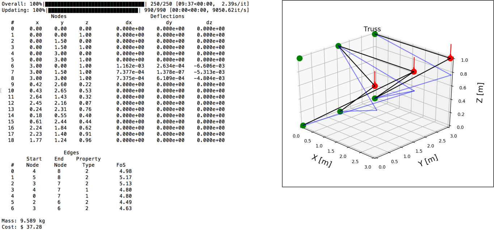

========
Examples
========

Pyramid Example Configuration File
***********************************
::
  [general]
  user_spec_nodes = '[[0,-.5,0],[0,.5,0],[0,0,1],[2,0,0]]'
  loads = '[[0,0,0,0,0,0],[0,0,0,0,0,0],[0,0,0,0,0,0],[0,0,-10000,0,0,0]]'
  fixtures = '[[1,1,1,1,1,1],[1,1,1,1,1,1],[1,1,1,1,1,1],[0,0,0,0,0,0]]'
  num_rand_nodes = 10 # int
  num_rand_edges = 10 # int
  properties_path = 'gastop-config/properties.csv'
  domain = '[[-1, -1, -1], [5, 1, 2]]'

  [fitness_params]
  equation = weighted_sum
         [[parameters]]
         goal_fos = 4
         critical_nodes = '[3]'
         w_fos = 10000
         w_mass = 1
         w_deflection = 100

  [evaluator_params]
  struct_solver = mat_struct_analysis_DSM
  mass_solver = mass_basic
  interferences_solver = blank_test
  cost_solver = cost_calc

  [ga_params]
  num_threads = 1
  pop_size = 1500
  num_generations = 50
  num_elite = 15
  percent_mutation =
  percent_crossover =
  save_frequency = 5
  save_filename_prefix = Recorded_States_

  [monitor_params]
  progress_fitness = True
  progress_truss = True

  # optional stuff

  [random_params]
  rng_seed =

  [crossover_params]
  node_crossover_method =
  edge_crossover_method =
  property_crossover_method =
        [[node_crossover_params]]
        [[edge_crossover_params]]
        [[property_crossover_params]]

  [mutator_params]
  node_mutator_method =
  edge_mutator_method =
  property_mutator_method =
        [[node_mutator_params]]
        std =
        [[edge_mutator_params]]
        proportions =
        [[property_mutator_params]]
        proportions =

  [selector_params]
  method =
         [[method_params]]
         tourn_size =
         tourn_prob =

Pyramid Example Results
************************

For this example there are three nodes that are fixed in all six degrees of
freedom at XYZ locations [0,-.5,0] , [0,.5,0] , [0,0,1].  A load is applied at
[2,0,0] in the negative Z direction with a magnitude of 10,000 N.  The genetic
algorithm uses a population size of 1500, runs for 50 generations, and is
the structure is required to have a safety factor of four.  The displacement is
minimized for node 3 which is the loaded node at [2,0,0].  To run this example
the command is as shown below:

.. code-block:: bash

	$ gastop gastop-config/struct_making_test_init2.txt

The results of this simulation are:

.. image:: images/example1_structandprint.png
    :alt: Simple Truss Optimization Result and Command Line Printout

Here the fixed nodes are shown in green, the loads are shown in red, and the
truss is shown in black.  The blue lines show how the truss deforms under the
load magnified by a factor of 50 to be visible.  The evolution of the
optimization algorithm is shown here:

.. figure:: /images/example1_sim.gif
    :alt: Simple Truss Optimization Evolution

Cantilever Example Results
************************

For this example there are six nodes that are fixed in all six degrees of
freedom at XYZ locations [0,0,0], [0,0.001,1], [0,1.5,0], [0,1.5001,1], [0,3,0],
[0,3.0001,1].  Three loads are applied at [3,0,1], [3,1.5,1], [3,3,1] in the
negative Z direction, each with a magnitude of 1000 N.  The genetic
algorithm uses a population size of 1000, runs for 250 generations, and is
the structure is required to have a safety factor of four.  The displacement is
minimized for node 7 which is the middle loaded node at [3,1.5,1]. To run this
example the command is as shown below:

.. code-block:: bash

	$ gastop gastop-config/init_cantilevered_test.txt

The results of this simulation are:

Here the fixed nodes are shown in green, the loads are shown in red, and the
truss is shown in black.  The blue lines show how the truss deforms under the
load magnified by a factor of 50 to be visible.
