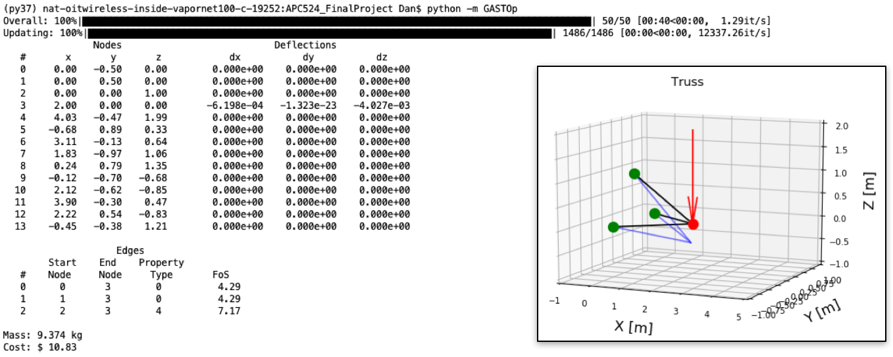

=====
Usage
=====

gastop can either be run from the command line, or used in a python script.

Command Line
************

If it was installed from PyPI using pip, it can be run from the command line as:

.. code-block:: bash

	$ gastop <config_file_path>

If the code was cloned from github instead, the normal commandline shortcut will not be installed.
It can still be run from the repository main directory as:

.. code-block:: bash

	$ python -m gastop <config_file_path>

In either case, additional arguments can be passed via the command line:

.. code-block:: bash

    	usage: gastop [-h] [-p] [-g] [-t] [-q | -d] config_path

	positional arguments:
	config_path          file path to gastop config file

	optional arguments:
	-h, --help           show this help message and exit
	-p , --pop_size      population size. If not specified, defaults to what is
                             in config.
	-g , --num_gens      number of generations. If not specified, defaults to
                             what is in config.
	-t , --num_threads   number of threads to use. If not specified, defaults to
	                     what is in config.
	-q, --quiet          hide progress display window
	-d, --display        show progress display window

Python Package
**************

gastop can also be used from within python, either in a script or interactively.

.. code-block:: python

   import gastop
   config_file_path = "./path_to_config_file.txt"
   ga = gastop.GenAlg(config_file_path)
   ga.initialize_population(pop_size=1e4)
   best_truss, history = ga.run(num_generations=100, progress_display=1, num_threads=4)

Examples
**************

For this example there are three nodes that are fixed in all six degrees of
freedom at XYZ locations [0,-.5,0] , [0,.5,0] , [0,0,1].  A load is applied at
[2,0,0] in the negative Z direction with a magnitude of 10,000 N.  The genetic
algorithm uses a population size of 1500, runs for 50 generations, and is
the structure is required to have a safety factor of four.  To run this example
the command is as shown below:

.. code-block:: bash

	$ gastop gastop-config/struct_making_test_init2.txt

The results of this simulation are:

	Simple Truss Optimization Result and Command Line Printout

Here the fixed nodes are shown in green, the loads are shown in red, and the
truss is shown in black.  The blue lines show how the truss deforms under the
load magnified by a factor of 50 to be visible.  The evolution of the
optimization algorithm is shown here:

.. figure:: /images/example1_sim.gif
	Simple Truss Optimization Evolution
